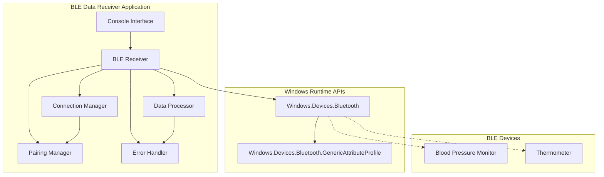
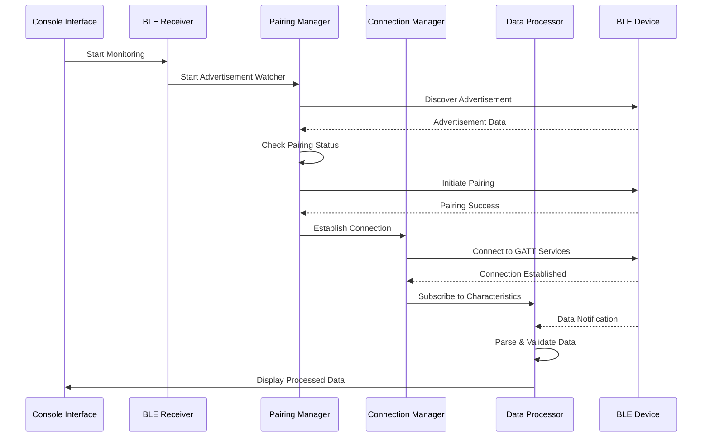

# Design Document: BLE Data Receiver

## Overview

本設計文檔描述了一個基於.NET 8 Console應用程式的BLE數據接收器系統。該系統使用Windows Runtime API來實現BLE設備的自動發現、配對、連接管理和數據接收功能，專門針對醫療設備（血壓計和額溫計）進行優化。

系統採用事件驅動的異步架構，確保在處理多個BLE設備時的高效性和響應性。通過實現IEEE 11073標準的醫療設備數據格式解析，系統能夠準確處理來自不同廠商的醫療設備數據。

## Architecture

### System Architecture Diagram



### Component Interaction Flow



## Components and Interfaces

### 1. BLE Receiver (核心組件)

**職責：**
- 協調所有BLE相關操作
- 管理組件間的通信
- 處理應用程式生命週期

**主要接口：**
```csharp
public interface IBLEReceiver
{
    Task StartAsync(CancellationToken cancellationToken);
    Task StopAsync();
    event EventHandler<DeviceDataReceivedEventArgs> DataReceived;
    event EventHandler<ConnectionStatusChangedEventArgs> ConnectionStatusChanged;
}
```

**關鍵方法：**
- `StartAsync()`: 初始化所有組件並開始監聽
- `StopAsync()`: 優雅地停止所有操作並清理資源
- `HandleDeviceDiscovered()`: 處理新發現的設備
- `HandleDataReceived()`: 處理接收到的數據

### 2. Pairing Manager (配對管理器)

**職責：**
- 監聽BLE設備廣播
- 自動配對未配對的醫療設備
- 管理配對狀態

**主要接口：**
```csharp
public interface IPairingManager
{
    Task StartAdvertisementWatcherAsync();
    Task<bool> PairDeviceAsync(BluetoothLEDevice device);
    bool IsTargetDevice(BluetoothLEAdvertisement advertisement);
    event EventHandler<DeviceDiscoveredEventArgs> DeviceDiscovered;
}
```

**實現細節：**
- 使用 `BluetoothLEAdvertisementWatcher` 監聽廣播
- 通過Service UUID識別目標醫療設備
- 實現自動配對邏輯，包括重試機制

### 3. Connection Manager (連接管理器)

**職責：**
- 管理BLE設備連接狀態
- 實現自動重連機制
- 監控連接健康狀態

**主要接口：**
```csharp
public interface IConnectionManager
{
    Task<bool> ConnectAsync(BluetoothLEDevice device);
    Task DisconnectAsync(ulong deviceId);
    Task<bool> ReconnectAsync(ulong deviceId);
    ConnectionStatus GetConnectionStatus(ulong deviceId);
    event EventHandler<ConnectionStatusChangedEventArgs> ConnectionStatusChanged;
}
```

**重連策略：**
- 指數退避算法：1s, 2s, 4s間隔重試
- 最大重試次數：3次
- 連接超時：30秒

### 4. Data Processor (數據處理器)

**職責：**
- 解析IEEE 11073格式的醫療數據
- 驗證數據有效性
- 轉換數據格式供顯示使用

**主要接口：**
```csharp
public interface IDataProcessor
{
    Task<MedicalData> ProcessDataAsync(GattCharacteristic characteristic, byte[] rawData);
    bool ValidateData(MedicalData data);
    event EventHandler<DataProcessedEventArgs> DataProcessed;
}
```

**支持的數據格式：**
- 血壓數據：收縮壓、舒張壓、心率（IEEE 11073-10407標準）
- 體溫數據：攝氏溫度值（IEEE 11073-10408標準）

### 5. Console Interface (控制台界面)

**職責：**
- 提供用戶交互界面
- 顯示實時數據和狀態信息
- 處理用戶輸入和程式控制

**主要接口：**
```csharp
public interface IConsoleInterface
{
    Task DisplayWelcomeAsync();
    Task DisplayDataAsync(MedicalData data);
    Task DisplayStatusAsync(string status);
    Task DisplayErrorAsync(string error);
    Task HandleUserInputAsync(CancellationToken cancellationToken);
}
```

## Data Models

### Core Data Models

```csharp
// 基礎醫療數據模型
public abstract class MedicalData
{
    public DateTime Timestamp { get; set; }
    public string DeviceId { get; set; }
    public DeviceType DeviceType { get; set; }
    public bool IsValid { get; set; }
}

// 血壓數據模型
public class BloodPressureData : MedicalData
{
    public float SystolicPressure { get; set; }  // mmHg
    public float DiastolicPressure { get; set; } // mmHg
    public int HeartRate { get; set; }           // bpm
    public bool IsHypertensive => SystolicPressure > 140 || DiastolicPressure > 90;
}

// 體溫數據模型
public class TemperatureData : MedicalData
{
    public float Temperature { get; set; }        // Celsius
    public TemperatureUnit Unit { get; set; }
    public bool IsFever => Temperature > 37.5f;
}

// 設備類型枚舉
public enum DeviceType
{
    BloodPressureMonitor,
    Thermometer
}

// 連接狀態枚舉
public enum ConnectionStatus
{
    Disconnected,
    Connecting,
    Connected,
    Reconnecting,
    Failed
}
```

### IEEE 11073 Data Format Support

系統實現對以下IEEE 11073標準格式的支持：

**血壓計數據格式 (IEEE 11073-10407):**
- SFLOAT格式：16位浮點數表示壓力值
- 數據結構：Flags(1) + Systolic(2) + Diastolic(2) + MAP(2) + Timestamp(7) + Pulse(2)
- 單位：mmHg (millimeters of mercury)

**體溫計數據格式 (IEEE 11073-10408):**
- FLOAT格式：32位浮點數表示溫度值
- 數據結構：Flags(1) + Temperature(4) + Timestamp(7) + Type(1)
- 單位：攝氏度 (Celsius)

## Correctness Properties

*A property is a characteristic or behavior that should hold true across all valid executions of a system-essentially, a formal statement about what the system should do. Properties serve as the bridge between human-readable specifications and machine-verifiable correctness guarantees.*

在進行正確性屬性分析之前，我需要先分析需求文檔中的接受標準，以確定哪些可以轉化為可測試的屬性。

基於上述分析，以下是系統的正確性屬性：

### Property 1: Advertisement Monitoring Initialization
*For any* system startup, the BLE advertisement watcher should be properly initialized and actively monitoring for device broadcasts
**Validates: Requirements 1.1**

### Property 2: Automatic Pairing Behavior
*For any* discovered medical device (blood pressure monitor or thermometer) that is not paired, the system should automatically attempt pairing
**Validates: Requirements 1.2, 1.3**

### Property 3: Post-Pairing Connection Establishment
*For any* successful device pairing, the system should establish a connection and begin data reception
**Validates: Requirements 1.4**

### Property 4: Pairing Failure Recovery
*For any* pairing failure, the system should log the error and continue monitoring for other devices without interruption
**Validates: Requirements 1.5**

### Property 5: Medical Device Data Reception
*For any* medical device data transmission, the system should correctly receive all expected data fields (systolic/diastolic/heart rate for blood pressure monitors, temperature for thermometers)
**Validates: Requirements 2.1, 2.2**

### Property 6: Data Validation and Processing
*For any* received data, the system should validate format and value ranges, displaying valid data immediately and handling invalid data gracefully
**Validates: Requirements 2.3, 2.4, 2.5**

### Property 7: Connection Interruption Detection
*For any* BLE connection interruption, the system should detect the status change and automatically initiate reconnection attempts
**Validates: Requirements 3.1, 3.2**

### Property 8: Reconnection Status Display
*For any* reconnection process, the system should display the current reconnection status to the user
**Validates: Requirements 3.3**

### Property 9: Connection Recovery
*For any* successful reconnection, the system should restore full data reception functionality
**Validates: Requirements 3.5**

### Property 10: Real-time Display Formatting
*For any* system operation, the console interface should display connection status, received data, timestamps, and status information in a clear, consistent format
**Validates: Requirements 4.2, 4.5**

### Property 11: Resource Cleanup on Shutdown
*For any* program termination, the system should properly close all BLE connections and clean up resources
**Validates: Requirements 4.4**

### Property 12: Comprehensive Error Logging
*For any* error condition (BLE errors, parsing failures, connection issues), the system should log detailed error information including context and original data where applicable
**Validates: Requirements 5.1, 5.2, 5.3**

### Property 13: User Error Display
*For any* error condition, the system should display appropriate error information to the user without exposing technical details
**Validates: Requirements 5.4**

### Property 14: Graceful Fatal Error Handling
*For any* fatal error condition, the system should terminate gracefully while preserving data integrity
**Validates: Requirements 5.5**

### Property 15: IEEE 11073 Medical Data Parsing
*For any* IEEE 11073 formatted medical device data, the system should correctly parse all data fields according to the standard (blood pressure: systolic/diastolic/heart rate; temperature: celsius value)
**Validates: Requirements 6.1, 6.2, 6.5**

### Property 16: Abnormal Value Warning Display
*For any* medical measurement outside normal ranges (blood pressure >140/90 mmHg, temperature >37.5°C), the system should display appropriate warning indicators
**Validates: Requirements 6.3, 6.4**

## Error Handling

### Error Categories and Handling Strategies

**1. BLE Communication Errors**
- **Connection Timeout**: 30秒超時，自動重試
- **Device Not Found**: 記錄錯誤，繼續監聽其他設備
- **Pairing Failure**: 記錄詳細錯誤信息，不中斷整體操作
- **Data Transmission Error**: 請求重傳，記錄失敗次數

**2. Data Processing Errors**
- **Invalid Data Format**: 記錄原始數據，跳過當前數據包
- **Out of Range Values**: 標記為異常但仍顯示，添加警告標識
- **Parsing Exception**: 捕獲異常，記錄詳細錯誤信息

**3. System Level Errors**
- **Memory Allocation Failure**: 嘗試清理資源，優雅終止
- **Threading Exceptions**: 重啟相關線程，記錄錯誤
- **Unhandled Exceptions**: 全局異常處理器捕獲，安全終止

### Error Recovery Mechanisms

```csharp
// 重連策略實現
public class ReconnectionStrategy
{
    private readonly int[] RetryIntervals = { 1000, 2000, 4000 }; // 指數退避
    private const int MaxRetries = 3;
    
    public async Task<bool> AttemptReconnectionAsync(BluetoothLEDevice device)
    {
        for (int attempt = 0; attempt < MaxRetries; attempt++)
        {
            try
            {
                await Task.Delay(RetryIntervals[attempt]);
                var result = await ConnectToDeviceAsync(device);
                if (result.IsSuccess)
                    return true;
            }
            catch (Exception ex)
            {
                LogError($"Reconnection attempt {attempt + 1} failed", ex);
            }
        }
        return false;
    }
}
```

## Testing Strategy

### Dual Testing Approach

本系統採用單元測試和屬性測試相結合的綜合測試策略：

**單元測試職責：**
- 測試特定的示例和邊界情況
- 驗證組件間的集成點
- 測試錯誤條件和異常處理
- 驗證特定的用戶交互場景

**屬性測試職責：**
- 驗證跨所有輸入的通用屬性
- 通過隨機化實現全面的輸入覆蓋
- 測試系統在各種條件下的行為一致性
- 驗證設計文檔中定義的正確性屬性

### Property-Based Testing Configuration

**測試框架選擇：** FsCheck.NUnit for .NET 8
- 每個屬性測試最少運行100次迭代
- 使用自定義生成器創建有效的BLE數據格式
- 每個測試必須引用對應的設計屬性

**測試標記格式：**
```csharp
[Test]
[Property]
// Feature: ble-data-receiver, Property 1: Advertisement Monitoring Initialization
public void Property_AdvertisementMonitoringInitialization_ShouldStartWatcherOnSystemStartup()
{
    // 屬性測試實現
}
```

### Test Data Generation Strategy

**BLE數據生成器：**
- IEEE 11073格式的血壓數據生成器
- IEEE 11073格式的體溫數據生成器
- 無效數據格式生成器（用於錯誤處理測試）
- 邊界值生成器（正常範圍邊界的數值）

**設備模擬：**
- 模擬BLE設備廣播
- 模擬配對過程
- 模擬連接中斷和恢復
- 模擬數據傳輸錯誤

### Integration Testing

**端到端測試場景：**
1. 完整的設備發現到數據接收流程
2. 多設備並發連接和數據處理
3. 連接中斷和自動重連流程
4. 異常情況下的系統穩定性

**測試環境要求：**
- Windows 10/11 with Bluetooth 4.0+ support
- 模擬BLE設備或實際醫療設備
- .NET 8 Runtime environment

### Performance Testing

**性能指標：**
- 設備發現時間：< 5秒
- 配對完成時間：< 10秒
- 數據處理延遲：< 100ms
- 內存使用：< 50MB
- CPU使用率：< 10%（空閒時）

**負載測試：**
- 同時連接多個設備（最多5個）
- 高頻數據傳輸測試
- 長時間運行穩定性測試（24小時）

## Technical Dependencies

### Core Dependencies

**Windows Runtime APIs:**
- `Windows.Devices.Bluetooth` - BLE設備管理
- `Windows.Devices.Bluetooth.Advertisement` - 設備廣播監聽
- `Windows.Devices.Bluetooth.GenericAttributeProfile` - GATT服務訪問

**NuGet Packages:**
```xml
<PackageReference Include="Microsoft.Windows.SDK.Contracts" Version="10.0.22621.2428" />
<PackageReference Include="System.Reactive" Version="6.0.0" />
<PackageReference Include="Microsoft.Extensions.Hosting" Version="8.0.0" />
<PackageReference Include="Microsoft.Extensions.Logging" Version="8.0.0" />
<PackageReference Include="Serilog.Extensions.Hosting" Version="8.0.0" />
<PackageReference Include="FsCheck.NUnit" Version="2.16.5" />
```

### Platform Requirements

**Operating System:**
- Windows 10 version 1903 (build 18362) or later
- Windows 11 (recommended)

**Hardware Requirements:**
- Bluetooth 4.0+ adapter
- Minimum 4GB RAM
- .NET 8 Runtime

**Development Environment:**
- Visual Studio 2022 or later
- .NET 8 SDK
- Windows SDK 10.0.22621.0 or later

### IEEE 11073 Implementation

**血壓計數據格式支持：**
- Service UUID: `0x1810` (Blood Pressure Service)
- Characteristic UUID: `0x2A35` (Blood Pressure Measurement)
- Data format: Flags + Systolic + Diastolic + MAP + Timestamp + Pulse Rate

**體溫計數據格式支持：**
- Service UUID: `0x1809` (Health Thermometer Service)  
- Characteristic UUID: `0x2A1C` (Temperature Measurement)
- Data format: Flags + Temperature + Timestamp + Temperature Type

**數據解析實現：**
```csharp
public class IEEE11073Parser
{
    public BloodPressureData ParseBloodPressure(byte[] data)
    {
        // IEEE 11073-10407 標準實現
        var flags = data[0];
        var systolic = ParseSFloat(data, 1);
        var diastolic = ParseSFloat(data, 3);
        var heartRate = ParseSFloat(data, 13);
        
        return new BloodPressureData
        {
            SystolicPressure = systolic,
            DiastolicPressure = diastolic,
            HeartRate = (int)heartRate,
            Timestamp = DateTime.Now
        };
    }
    
    private float ParseSFloat(byte[] data, int offset)
    {
        // IEEE 11073 SFLOAT 格式解析
        var value = BitConverter.ToUInt16(data, offset);
        var mantissa = value & 0x0FFF;
        var exponent = (value & 0xF000) >> 12;
        
        if (exponent >= 8)
            exponent = exponent - 16;
            
        return mantissa * (float)Math.Pow(10, exponent);
    }
}
```

## Security Considerations

**數據安全：**
- 所有BLE通信使用加密連接
- 敏感醫療數據不持久化存儲
- 實現適當的訪問控制機制

**隱私保護：**
- 設備標識符匿名化處理
- 用戶數據本地處理，不上傳雲端
- 符合醫療數據隱私法規要求

**系統安全：**
- 輸入驗證防止惡意數據注入
- 異常處理防止信息洩露
- 安全的資源清理和內存管理